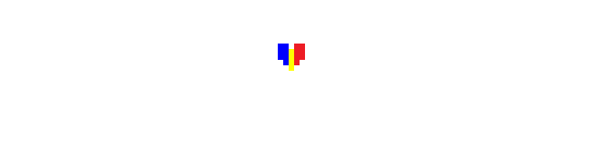

  

# DELTARUNE Capitolul 1&2 în Română
<b>NOTĂ</b>: Această pagină este doar pentru development. Pentru lansări oficiale ale modului, intră [aici](https://douper.itch.io/deltromana).

Această traducere a fost începută de Douper și am reușit să creăm un mod care traduce tot jocul DELTARUNE în limba română.
Dacă întâmpini probleme, nu uita să le raportezi ori pe [server-ul de Discord](https://discord.gg/d74nGytPJH) ori aici printr-un Issue sau Pull Request.

# Contribuire
Cum să contribui la mod:
- Creează un fork al repo-ul și descarcă fișierele;
- Descarcă scriptul [UMP](https://github.com/nhaar/ump/releases) și pune-l în folderul principal al modului (în același folder cu ch1&2.csx și main.csx);
- Folosește [această](https://github.com/UnderminersTeam/UndertaleModTool/releases/download/0.6.1.0/UndertaleModTool_v0.6.1.0-SingleFile.zip) versiune de UndertaleModTool (v0.6.1.0);
- Deschide data.win-ul jocului, apasă sus pe Scripts -> Run other script... -> ch1&2.csx pentru a importa modul și poți salva fișierul (versiunile suportate sunt 1.08 - 1.15);
- Poți vedea un ghid despre cum să folosești UMP [aici](https://github.com/nhaar/ump/blob/main/guide/guide.md);
- Dacă ai făcut niște modificări și vrei să fie adăugate în mod, deschide un Pull Request și ne vom uita peste el.

# Credite
- Traducere: <b>Douper</b>, Cheo, NERS, Salt, psychotic1;
- Ajutor pentru unele sprite-uri mai complicate: hugothewaffle;
- UMP: nhaar.
